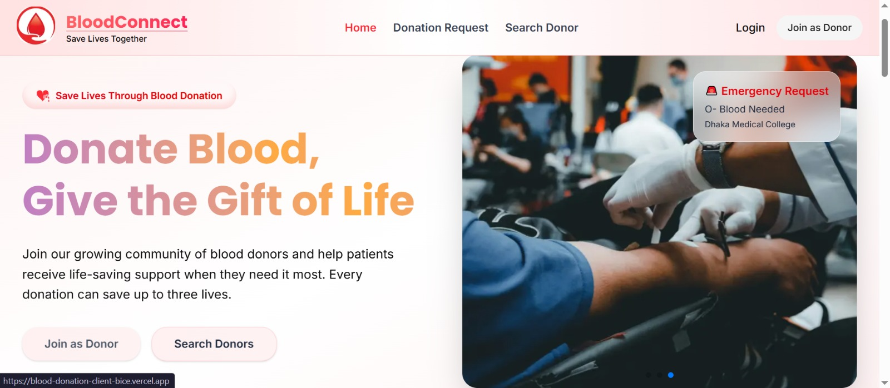
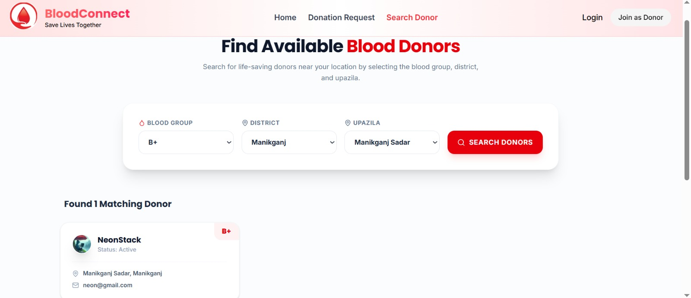
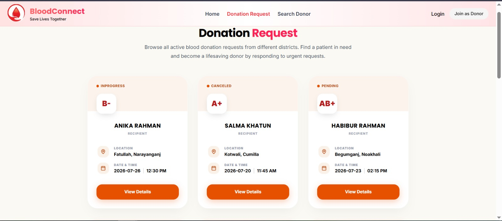
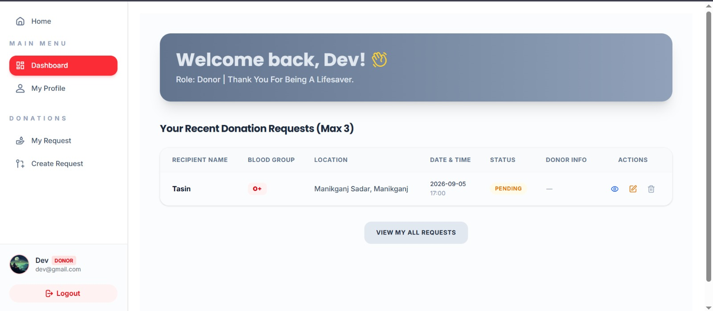
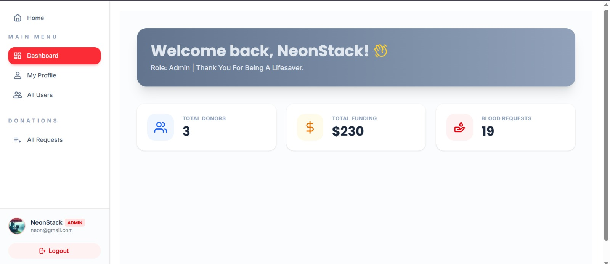

# 🩸 BloodConnect

<p align="center">
  <strong>A modern blood donation platform connecting donors with people in need.</strong>
</p>

<p align="center">
  BloodConnect simplifies the blood donation process by helping users find suitable donors,
  create urgent blood requests, manage donations, and support the platform through secure funding.
</p>

<p align="center">
  <a href="https://github.com/Mahedi-5g/blood-connect-client">
    
  </a>
  <a href="https://github.com/Mahedi-5g">
    
  </a>
</p>

---

## 📌 Overview

**BloodConnect** is a full-stack blood donation platform designed to make it easier for people to find blood donors and manage donation requests.

The platform provides a structured workflow for creating blood requests, discovering potential donors by location and blood group, managing donation requests, and controlling users through role-based dashboards.

It also includes a secure **Stripe-powered funding system** that allows users to financially support the platform.

### 🎯 Problem It Solves

Finding compatible blood donors quickly can be difficult during emergencies.

BloodConnect aims to reduce this difficulty by providing:

* 🔍 Fast donor discovery
* 🩸 Blood-group based filtering
* 📍 District and upazila based search
* 📋 Organized donation requests
* 👥 Role-based management
* 💳 Secure financial donations
* 🔐 Protected user accounts

---

# ✨ Key Features

## 🩸 Blood Donation Requests

Users can create detailed blood donation requests containing:

* Recipient name
* Blood group
* District
* Upazila
* Hospital name
* Full address
* Donation date
* Additional request information

Requests follow a clear lifecycle:

```text
Pending
   ↓
In Progress
   ↓
Done
   │
   └── Canceled
```

---

## 🔎 Donor Search

Users can search for suitable blood donors based on:

* 🩸 Blood group
* 📍 District
* 🗺️ Upazila

This makes it easier to identify potential donors in a specific location.

---

## 👥 Role-Based Access Control

BloodConnect supports three primary roles:

### 🩸 Donor / User

Users can:

* Create blood donation requests
* View their requests
* Update their profile
* Search for donors
* Respond to donation requests
* View donation history
* Make financial contributions

### 🤝 Volunteer

Volunteers can:

* View donation requests
* Help manage request status
* Update requests during the donation workflow
* Support platform moderation

### 🛡️ Admin

Administrators have full platform control.

They can:

* Manage users
* Block / unblock users
* Change user roles
* Promote donors to volunteers
* Promote users to administrators
* Manage donation requests
* Monitor platform activity

---

# 🔐 Authentication & Security

BloodConnect uses **Better Auth** for authentication and session management.

Security-related features include:

* 🔐 User authentication
* 👤 Session management
* 🛡️ Role-based authorization
* 🔒 Protected dashboard routes
* 🚫 Blocked-user restrictions
* 🔑 Secure server-side request verification
* 🛡️ Protected donation-management operations

---

# 💳 Funding & Stripe Payments

BloodConnect includes a funding system powered by **Stripe**.

Users can contribute financially to support the platform.

### Payment Flow

```text
User
  ↓
Select Donation Amount
  ↓
Checkout Session
  ↓
Stripe Checkout
  ↓
Successful Payment
  ↓
Funding Record
  ↓
Donation History
```

The payment flow is designed to keep sensitive payment information within Stripe rather than handling card details directly inside the application.

---

# 📊 Dashboard

BloodConnect provides role-specific dashboards.

### Dashboard includes

* 📈 Overview
* 👤 My Profile
* 🩸 My Donation Requests
* ➕ Create Donation Request
* 👥 All Users — Admin
* 📋 All Blood Donation Requests — Admin
* 💰 Funding / Donation History
* ⚙️ Account management

Different dashboard options are displayed according to the user's role.

---

# 🧑‍💻 Tech Stack

## Frontend

<p>
  
  
  
  
  
</p>

## Data Fetching & State

<p>
  
  
</p>

## Backend

<p>
  
  
</p>

## Database

<p>
  
</p>

## Authentication & Payments

<p>
  
  
</p>

## Other Tools

<p>
  
  
  
  
</p>

---

# 🏗️ Project Architecture

```text
BloodConnect
│
├── Client
│   ├── app/
│   │   ├── auth/
│   │   ├── dashboard/
│   │   ├── donationRequest/
│   │   ├── searchDonor/
│   │   └── funding/
│   │
│   ├── components/
│   │   ├── Navbar
│   │   ├── Footer
│   │   ├── Banner
│   │   ├── Donation Cards
│   │   └── Dashboard Components
│   │
│   ├── lib/
│   │   └── Authentication
│   │
│   └── public/
│       └── Images & Assets
│
└── Server
    ├── routes/
    │   ├── Users
    │   ├── Donation Requests
    │   ├── Donors
    │   └── Funding
    │
    ├── middleware/
    │   └── Authentication & Authorization
    │
    ├── database/
    │   └── MongoDB
    │
    └── index.js
```

> Update this structure if your actual repository folders use different names.

---

# 🚀 Getting Started

## Prerequisites

Make sure you have the following installed:

* Node.js 18+
* npm
* MongoDB / MongoDB Atlas
* Stripe account for payment functionality

---

## 1. Clone the Repository

```bash
git clone https://github.com/Mahedi-5g/blood-connect-client.git
cd blood-connect-client
```

---

## 2. Install Dependencies

```bash
npm install
```

---

## 3. Environment Variables

Create a `.env.local` file in the client project.

```env
NEXT_PUBLIC_API_URL=http://localhost:5000
NEXT_PUBLIC_IMGBB_API_KEY=your_imgbb_api_key
NEXT_PUBLIC_STRIPE_PUBLISHABLE_KEY=your_stripe_publishable_key
BETTER_AUTH_URL=http://localhost:3000
```

> Never commit `.env.local` or any file containing secret API keys to GitHub.

For the backend, create the environment file required by your server configuration.

Example:

```env
PORT=5000
MONGODB_URI=your_mongodb_connection_string
STRIPE_SECRET_KEY=your_stripe_secret_key
BETTER_AUTH_SECRET=your_better_auth_secret
```

> Keep the actual environment variable names synchronized with your server code.

---

# ▶️ Run Locally

### Start the frontend

```bash
npm run dev
```

The application will normally be available at:

```text
http://localhost:3000
```

### Start the backend

```bash
npm run dev
```

The API server will normally run at:

```text
http://localhost:5000
```

---

# 📸 Screenshots

## 🏠 Home Page

<p align="center">
  
</p>

---

## 🔎 Donor Search

<p align="center">
  
</p>

---

## 🩸 Donation Request

<p align="center">
  
</p>

---

## 📊 Dashboard

<p align="center">
  
</p>

---

## 🛡️ Admin Dashboard

<p align="center">
  
</p>

> Add these images inside a `screenshots` folder in the repository.

---

# 🌐 Live Demo

<p align="center">

<a href="https://blood-donation-client-bice.vercel.app/">
  
</a>

<a href="https://github.com/Mahedi-5g/blood-connect-client">
  
</a>

</p>

---

# 📡 Core API Features

The backend provides APIs for:

| Feature           | Method  | Purpose                       |
| ----------------- | ------- | ----------------------------- |
| Featured Requests | `GET`   | Get featured blood requests   |
| All Requests      | `GET`   | Retrieve donation requests    |
| Request Details   | `GET`   | Get a specific request        |
| Create Request    | `POST`  | Create a new blood request    |
| Update Request    | `PATCH` | Update request status         |
| Users             | `GET`   | Retrieve users                |
| User Management   | `PATCH` | Update role / status          |
| Funding           | `POST`  | Create payment / funding flow |
| Funding History   | `GET`   | Retrieve funding records      |

> Keep this table synchronized with the actual Express routes in your server.

---

# 📱 Responsive Design

BloodConnect is designed to provide a consistent experience across:

* 💻 Desktop
* 💼 Laptop
* 📱 Mobile
* 📟 Tablet

The interface uses responsive layouts and reusable components to adapt to different screen sizes.

---

# 🔄 Donation Request Workflow

```text
Create Request
      │
      ▼
   Pending
      │
      ▼
  In Progress
      │
      ├──────────────┐
      ▼              ▼
    Done          Canceled
```

This workflow helps users understand the current state of every donation request.

---

# 🎯 Future Improvements

Some potential future improvements include:

* 🔔 Real-time donation notifications
* 📱 Progressive Web App support
* 📍 Location-based donor discovery
* 🗺️ Interactive donor maps
* 💬 Donor-recipient communication
* 📧 Email notifications
* 📊 Advanced analytics
* 🏅 Donor achievement system
* 🩸 Donation reminders
* 🌙 Dark mode improvements
* 🌐 Multi-language support

---

# 🤝 Contributing

Contributions, issues, and feature requests are welcome!

### Fork the project

```bash
git clone https://github.com/Mahedi-5g/blood-connect-client.git
```

### Create a feature branch

```bash
git checkout -b feature/amazing-feature
```

### Commit your changes

```bash
git add .
git commit -m "Add amazing feature"
```

### Push your branch

```bash
git push origin feature/amazing-feature
```

Then open a Pull Request.

---

# 🐛 Issues & Feature Requests

If you discover a bug or have an idea for improving BloodConnect, please open an issue in the repository.

<a href="https://github.com/Mahedi-5g/blood-connect-client/issues">
  
</a>

---

# 📄 License

This project is available under the **MIT License**.

See the `LICENSE` file for more information.

---

# 👨‍💻 Author

## Mahedi Hasan

MERN Stack Developer | Full-Stack Developer | Problem Solver

<p>
  <a href="https://github.com/Mahedi-5g">
    
  </a>
  <a href="mailto:mahedi5096@gmail.com">
    
  </a>
  <a href="https://instagram.com/ma_hedi_0">
    
  </a>
</p>

---

<p align="center">
  <strong>🩸 Give Blood. Save Lives. Make a Difference.</strong>
</p>

<p align="center">
  ⭐ If you find BloodConnect useful, consider giving the repository a star!
</p>
